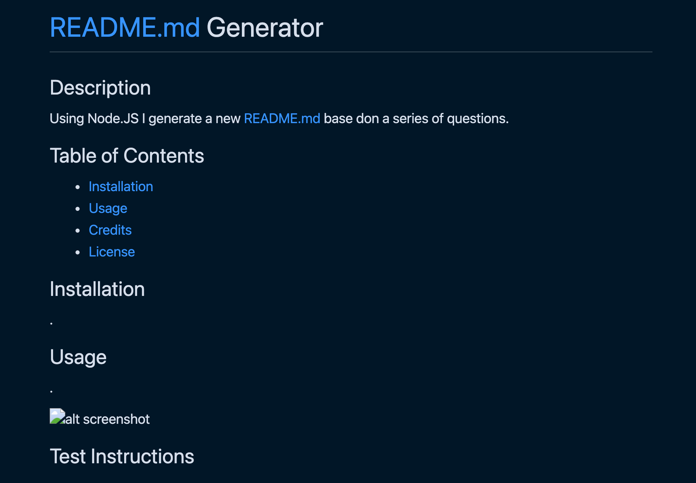

# README.md
  

  ## Description 

  Dynamically generating a README.md using Inquirer, Node.js and JavaScript.

  ## Table of Contents

 - [Installation](#installation)
 - [Usage](#usage)
 - [Credits](#credits)
 - [License](#license)

 ## Installation

  

## Usage

 

## Test Instructions

 

## Questions

  - [My GitHub](KevinJWesley)
  - [My Email] (email@email.com)

 ## Credits

 

## License 

ISC

  